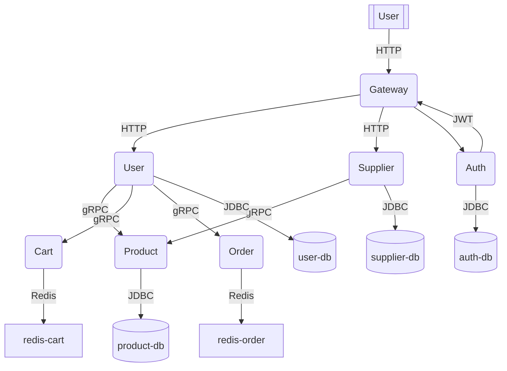

# Marketplace Micro-platform

## Краткое описание

Проект демонстрирует реализацию микросервисной архитектуры на основе Spring Boot 3.4 и Spring Cloud.
После клонирования репозитория, сборки Maven и запуска `docker compose` локально разворачивается полноценная платформа
из восьми сервисов, взаимодействующих по HTTP и gRPC. Решение предназначено для демонстрации практических навыков работы
со Spring-экосистемой, Docker, PostgreSQL, Redis и сопутствующими технологиями.

## Архитектура

| Сервис           | Назначение                                   | Путь в репозитории  |
|------------------|----------------------------------------------|---------------------|
| gateway-service  | Edge-шлюз, маршрутизация, валидация JWT      | `/gateway-service`  |
| auth-service     | Выдача JWT-токенов, OAuth2, RSA-ключи        | `/auth-service`     |
| user-service     | CRUD пользователей (gRPC + PostgreSQL)       | `/user-service`     |
| product-service  | Каталог товаров (gRPC + PostgreSQL)          | `/product-service`  |
| cart-service     | Корзина (gRPC + Redis)                       | `/cart-service`     |
| order-service    | Оформление заказов (gRPC + Redis)            | `/order-service`    |
| supplier-service | Управление поставщиками → публикация товаров | `/supplier-service` |
| config-service   | Spring Cloud Config Server (native repo)     | `/config-service`   |

<details>
<summary>Графическая схема (Mermaid)</summary>



</details>

## Быстрый запуск

> Требования: Docker 24+, Docker Compose v2, JDK 21 (только для локальной сборки).

```bash
# Клонирование репозитория
git clone https://github.com/grinchaus/marketplace.git
cd marketplace

# Сборка артефактов
./mvnw clean install -DskipTests

# Запуск всей платформы
docker compose up --build
```

После инициализации сервисы становятся доступны по следующему адресу:

| URL                     | Назначение |
|-------------------------|------------|
| `http://localhost:8080` | Gateway    |

## Примеры запросов

### 1. Получение JWT-токена

```bash
# Регистрация (signup)
curl -i -X POST "http://localhost:8080/auth/signup" \
  -H "Content-Type: application/json" \
  -H "Accept: application/json" \
  -H "X-Client-Type: user" \
  -d '{
        "username":"john",
        "email":"john@example.com",
        "password":"Secret123!",
        "roles":["USER"]
      }'

# Аутентификация (signin)
curl -i -X POST "http://localhost:8080/auth/signin" \
  -H "Content-Type: application/json" \
  -H "Accept: application/json" \
  -H "X-Client-Type: user" \
  -d '{
        "username":"john",
        "password":"Secret123!"
      }'
```

### 2. Работа с защищённым API

```bash
# Установите TOKEN (пример значения)
TOKEN='eyJhbGciOiJSUzI1NiJ9.eyJzdWIiOiJqb2huIi...'
# Используйте полученный токен
curl -i -X GET \
  -H "Authorization: Bearer ${TOKEN}" \
  -H "X-Client-Type: user" \
  -H "Accept: application/json" \
  http://localhost:8080/users/integrations/products
```

## Технологии

| Компонент           | Роль в проекте                            |
|---------------------|-------------------------------------------|
| Spring Boot 3.4     | Базовая платформа для всех сервисов       |
| Spring Cloud Config | Централизованная конфигурация, hot-reload |
| Spring Security     | JWT-аутентификация, RSA-ключи             |
| gRPC                | Межсервисное взаимодействие               |
| PostgreSQL 15       | Персистентное хранилище данных            |
| Redis 7             | In-memory хранилище корзин и заказов      |
| Docker Compose      | Оркестрация локальных контейнеров         |
| Lombok              | Генерация boilerplate-кода                |

В **auth-service** реализованы следующие ключевые компоненты:

* Безопасное хранение и управление RSA-ключами для подписи и верификации JWT.
* Обработка refresh-токенов для безопасного продления пользовательских сессий.

Проект включает комплекс интеграционных тестов, реализованных с использованием **MockMvc** и **Spring Boot Test**, которые проверяют корректность бизнес-логики и гарантируют надёжность **auth-service** и связанных компонентов.


## Режим разработки

```bash
# Запуск одного из сервисов
./mvnw spring-boot:run -pl auth-service -am

```

Автор — Манзюк Ростислав (grinchaus).